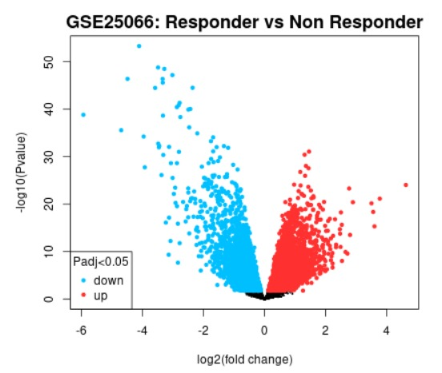
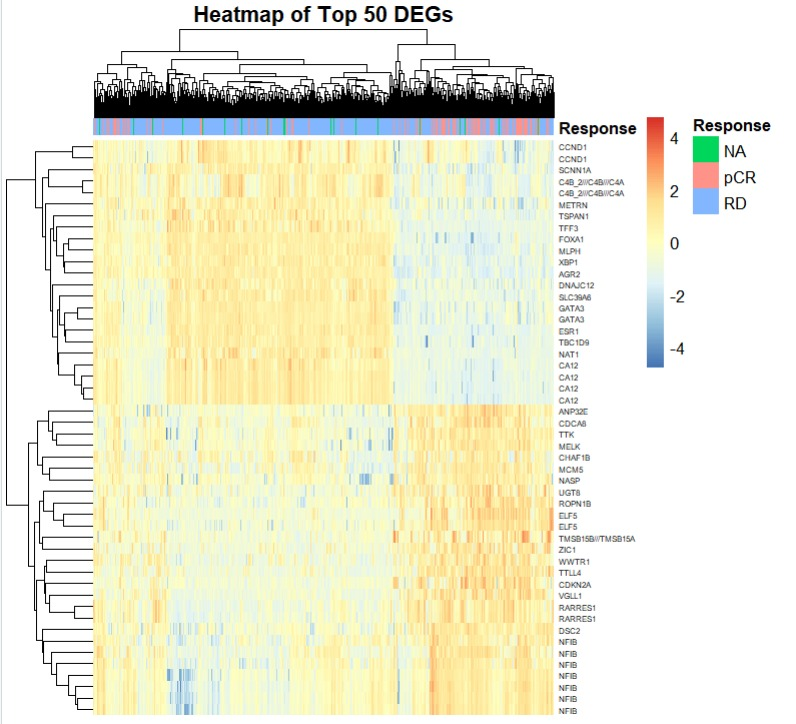
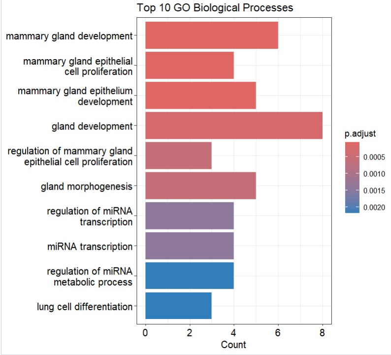
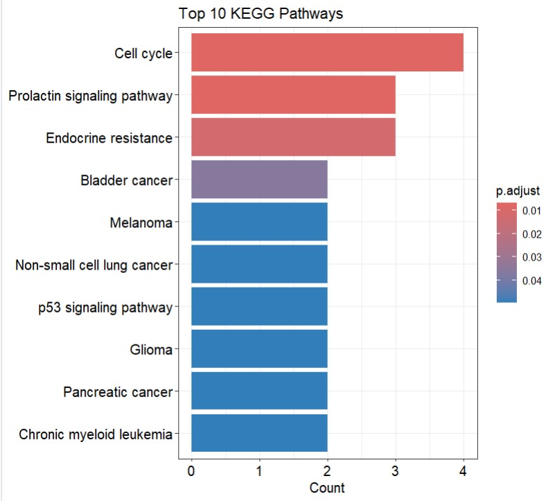

# Gene Expression Analysis of GSE25066

## Objective
Identify differentially expressed genes and perform functional enrichment analysis.

## Technologies
- R
- ggplot2
- pheatmap
- clusterProfiler

## Workflow
1. DEG filtering
2. Volcano plot visualization
3. Heatmap generation
4. GO enrichment
5. KEGG pathway analysis

## Results

### Volcano Plot

### Heatmap

### GO Enrichment

### KEGG Pathway Analysis

## Dataset
GEO Dataset: GSE25066
